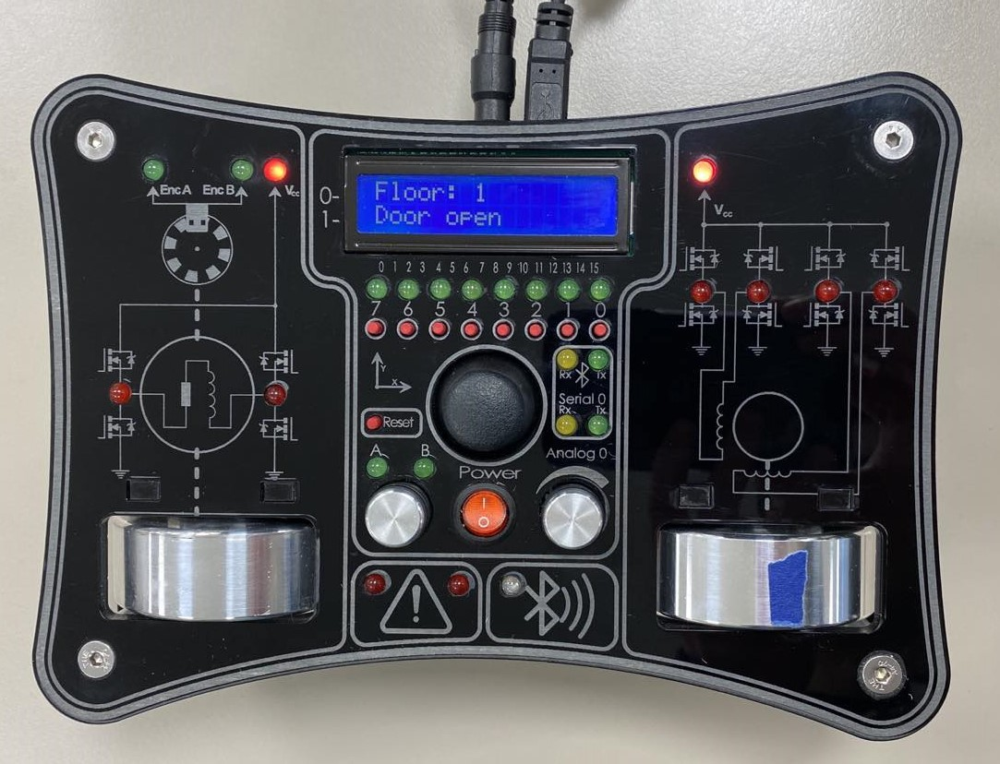

# MAS246 Project: Elevator System

*Project for the BSc. course MAS246 Motion Control*

The project revolves around the usage of the All in One Servo Lab 
created by Audun Hørthe, Helge Nødland and Bjørnar Preus-Olsen. It is a 
relatively synthetic project focused primarily around learning UML, 
programming with the arduino IDE, stepper control and servo control.

## Overview

- Required UML Class Diagram and State Machine Diagram are in UML folder
- Report and video are in current working directory
- The repository is left mostly as-is (except the additional 
  information added in this commit), with the delivered (and more 
  structured) zip folder also in the current working directory

## Delivered README Information (from ZIP file)

### Elevator Specifications
- 1 servo rotation = 0.5 [m]
- floors are 5 [m] apart
- 1 stepper rotation = 0.2 [m] door moved
- doors are 1.5 [m] wide

### Libraries and info
The elevator code requires the libraries <dac.h> for the DC motor and <LiquidCrystal.h> for the LCD screen.

### Usage
First select the usb port which the servo lab is connected to.
The elevator consists of 4 floors and the inputs are controlled by the keyboard only through the serial monitor.
To use the serial monitor as an input, first open the serial monitor, write the input in the message box and press enter.
The serial communication uses 19200 baud, and will not work if the serial monitor is not set to this.
The baud rate can be changed in the drop-down menu on the bottom-right or top-right depending on the Arduino IDE.

### Controls
The keyboard buttons 1,2,3,4 represent the internal elevator buttons for the respecitve floor and do not have a direction.
The lower-case letters q,w,e represent the outside up buttons for the floors 1,2,3 respectively.
The lower-case letters s,d,f represent the outside down buttons for the floors 2,3,4 respectively.

The elevator features a queue system and can dynamically change movement to the requested floor on new floor requests.

### Plotting
To use the in-built serial plotter, un-comment the lines: 277,281,289,285,289,293,299,302,308 in elevator.ino.
The output to the serial monitor without any modification is setup in a way that the data can be exported to a .csv file after minor changes.